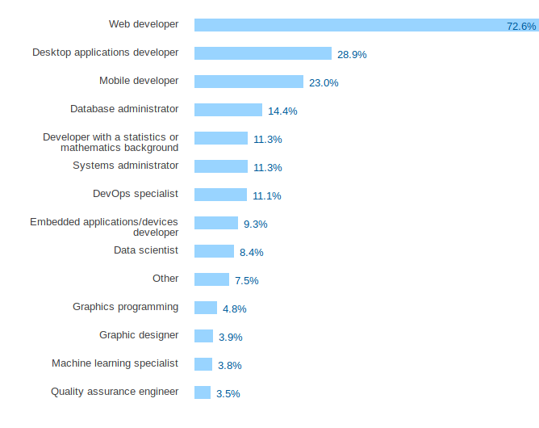
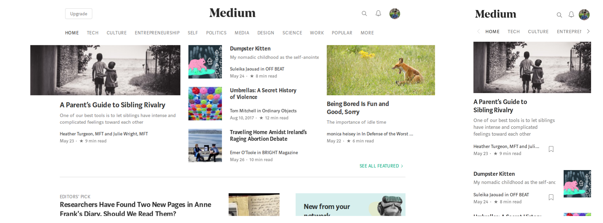

Hello, everyone! The web has evolved ever since it was first put in use. Web development has become an important realm of software development. This post will be a brief roadmap to full-stack web development. We can further split full stack developer to front-end and back-end development. Front-end is the work related to the code that runs on the browser. Or you could say it is more relevant to the GUI of the application. Then comes the Back-end, It refers to the code that will run on the server. First, we’ll look at the front-end.

*Taken from Stack Overflow Developer Survey Results 2017. [Click here](https://insights.stackoverflow.com/survey/2017) to view it completely.*

## Developer Toolkit

**Git and GitHub: **They both together are used for managing and collaborating over projects. Git is a version control system, it is used to manage versions of a project. GitHub is an online platform that allows collaboration on projects built using git as the version control system. It is mandatory for every software engineer/developer to know to use Git and GitHub.

**Linux:** It is mandatory for every developer to know how to use Linux systems. Majority of the servers that are hosting websites today are Linux servers. Also one should use Linux as his primary system as it gives you full access to your system, one has full control over the system. Also it is easier to develop on Linux, thanks to its efficient and user-friendly package management tools.

## The three core technologies

## Html and CSS

**Html **or Hypertext markup language is the standard markup language for creating web pages. It is the most basic and important technology for front-end development. It helps to structure your document.

**CSS **or Cascaded Style Sheets is a presentation language used to describe the presentation of documents is written in markup languages, like HTML. In short, it allows you to style your website, for example, add colors, change border thickness etc.

HTML and CSS are the most elemental building blocks for any web page. It highly important for every web developer to know it.

Here’s a free tutorial series that should help you get started with it :
[**Intro to HTML and CSS | Udacity**
*Learn how to convert digital design mockups into static web pages and how to build a responsive portfolio site to…*in.udacity.com](https://in.udacity.com/course/intro-to-html-and-css--ud304)

## JavaScript

Now coming to the big player. JavaScript is a scripting language that is used to make web pages interactive to use. And it is the only language that can be used to write scripts that run on browsers. Every browser has a dedicated JavaScript engine which executes the code.

Many beginners confuse for JavaScript to be related to Java. They both are totally different languages and have no connection to each other.

 to view it completely.](1*jPpVE2X_lYgsr-A52sYFsA.png)*Taken from Stack Overflow Developer Survey Results 2017. [Click here](https://insights.stackoverflow.com/survey/2017) to view it completely.*

JavaScript is one of the most popular programming languages used in the industry today. It is the most demanded skills in the market, and every Web Developer is expected to know it. JavaScript was initially built for client-side scripting, but in 2009 a software engineer Ryan Dahl built Node.js, a platform that allows execution of JavaScript on the server side, and the rest is history. Now Node.js is used heavily by innumerable companies, especially start-ups.

This tutorial series will help you get comfortable with the basics of Javascript :
[**Intro to JavaScript | Udacity**
*Learn the fundamentals of JavaScript, the most popular programming language in web development.*in.udacity.com](https://in.udacity.com/course/intro-to-javascript--ud803)

## CSS Frameworks and Responsive Web design

**Responsive Web design** is an approach to web design such that these pages are adaptable to different screen sizes and windows. To understand it more clearly, take a look at the screenshots below :

*Desktop : 1366 * 638 px ( The one on left ), Mobile : 750*1344 px ( The one on right )*

You can see how the layout changes according to the screen size. All the components rearrange themselves.

Well, you could write all the CSS by yourself. But there exist frameworks/libraries which have tons of CSS classes defined and extensive documentation on how to use them. This makes it very easy to style websites and build them keeping responsive layout in mind, as all these libraries are built with a responsive layout in mind.

## The Server-end

So now all that you have built is to present data to the user, basically code that is executed on the client side or on the user’s computer. Now let’s look at the server side. There is a wide range of languages and frameworks used to write servers. They can be categorized into 2 types :

**Full-stack :** Full-stack frameworks has built in libraries that help in building the back-end and the front-end as well. eg: Django, Laravel, Ruby on Rails, LAMP stack.

**Back-end : **These are more like libraries than a framework. They generally lack other components of a full-stack framework like template engine, ORM’s (Object relational mappers) etc. basically you could say these are a part of full stack frameworks. eg: Node/Express JS, Bottle Py.

One thing important to note is, just don’t learn how to use a framework or a language. Learn how it works and what it does. Now there are a lot of them out there, you don’t have to master everything. But something important to know is when to use what. Because each framework has its own advantages and disadvantages. Every one of them has their own domain of use and pros. A good developer should be able to make decisions based on project requirements.

## Database

A Database is an organized collection of data. We won’t go deep down this road here. It is a very vast topic and requires extensive study. Databases can be mainly categorized into to 2 major types on the basis of which data is visualized:

**Relational : **In here data is visualized and organized in the form on tables. These were the first database systems that were created. They are analogical to register entries in real life. Some popular examples are MySQL, PostgreSQL, MSSQL, Oracle SQL etc.

**No-SQL : **This basically covers up all the other data storage paradigms. The major type of No-SQL databases stores data in key-value pair format. Some of the popular examples of these type of databases are MongoDB, Redis etc.

Again here too don’t just learn how to use them. And get this clear that neither of them is better than the other. Both of them are conceptually different, Their use cases are different. There are some business models where SQL fits in right and No-SQL would be a pain to use, and vice-versa.

## Typescript

Typescript is a syntactical super-set of javascript. It adds static typing to javascript, ie the variable types are checked during compile time. This reduces bugs in the code and also makes the code more readable. When compiled it is basically converted back to javascript which then is run on the browser. Typescript is a powerful tool that you should add to your toolbox. Also one should know how to integrate typescript with their web projects using build tools.

## ECMAScript

It is a specification creating general-purpose scripting language, and javascript is a scripting language built according to ECMAScript specifications. Later versions of ECMAScript support a wider range of features which ease development. The latest version of ECMAScript is ES8. Also with this one should learn how to use ES with transpilers like babel. babel transpiles code from ES8 to ES5. The latest version supported by all the major browsers is ES5.

## Front-end frameworks

Front-end frameworks aid in the development of web-applications. But before starting off with it, ensure you have a strong hold over Typescript and ECMAScript. There are many of them out there, the following three are the most used in the industry :

**Angular JS : **It is an open-source framework developed and maintained by Google. They initially supported javascript, but now they have completely shifted to typescript. It’s initial release was in 2010. It has gained a lot of attention in the industry ever since then.

**React JS : **This** **one is developed and maintained by Facebook. There were some license** **issues, well the good news is its open-source now. React is more like a library than a framework. One has to connect other libraries with react to get the features of a full framework. It’s initial release was on 2013 and it too has gained a lot of popularity since then.

**Vue JS** : This one’s an interesting one, it’s not backed by any big company like the other two. It was developed by a single developer Evan you.It Currently being maintained by him and a very active community. It is a very interesting and simple library. Its popularity is rising exponentially since the last year. Its initial release was in 2013.

Now, I really wouldn’t want to rant on which is better than the other and why so. There are many articles out there for it. I personally would recommend you to start learning Vue JS first. As it’s very easy to learn compared to the others two. And after that, you could learn one of the others. To get a better idea of what other developers think about these frameworks, have a look at the graph attached below.

 to know more.](1*O1lg8scKPicjlNaP9reQJQ.png)*[Click here](https://stateofjs.com/2017/front-end/results) to know more.*

## CSS Preprocessors

If you worked on projects where you wrote CSS, you would have realized its terrible. It is really hard to organize code in CSS and managing styles and altering it is a nightmare. So this is where preprocessors come into play. They basically help you style using a developer-friendly syntax which is later translated into CSS. Some of the popular ones are :

**Sass : **It stands for Syntactically awesome style sheets. It was developed in ruby, to learn more [click here](https://sass-lang.com/).

**Less :** It stands for Leaner Style Sheets. It was developed in Javascript, to learn more [click here](http://lesscss.org/).

**Stylus : **It allows you to write Expressive, dynamic, robust CSS. To learn more [click here](http://stylus-lang.com/).

**PostCSS : **It is a tool for transforming CSS with JavaScript. To learn more [click here](https://postcss.org/).

## RESTful API

A RESTful API is an application program interface that uses HTTP requests to GET, PUT, POST and DELETE data. When the server is requested for data it mainly returns it in these formats : HTML, JSON, text. So in a RESTful API, the server responds with JSON data that is processed by the front-end and a corresponding UI is generated.

## Advanced JavaScript

Till now you might have used javascript. But not some of the deeper concepts of the language, It is a very powerful language. Some of the core concepts of the language are :

* The keyword “this”.

* Execution context, Lexical scope and Closures.

* JavaScript Objects and prototypes.

* Callbacks (Higher order functions), Promises and Async await in ES8.

## Build Tools

**Task Runner : **A Task runner basically runs commands that would otherwise be tedious. So what you is you define the tasks in a config file and it runs them all for you. Some tasks that it can do are to transpile Sass files to CSS, Typescript to javascript etc. Some popular task runners are [Gulp](https://gulpjs.com/) and [Grunt](https://gruntjs.com/).

**Module Bundlers : **A Module bundler is a build tool that takes modules with dependencies and emits static assets representing those modules. When working on bigger projects, the codebase gets bigger and unmanageable over time. Hence to maintain the understand-ability and scalability of the code, we split the code into modules.

**Phew !! **that was a big one. So all of it what I mentioned here is a minimum requirement for a full-stack web developer. The road might seem overwhelming, long and demotivating. But trust me, its fun and worth knowing all of it! :)
