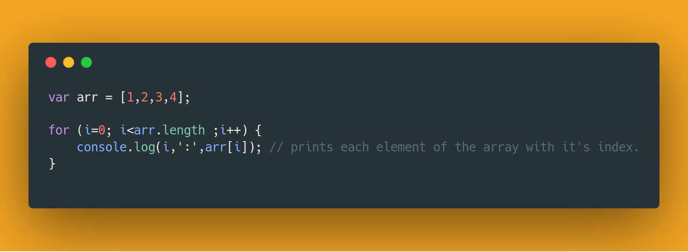
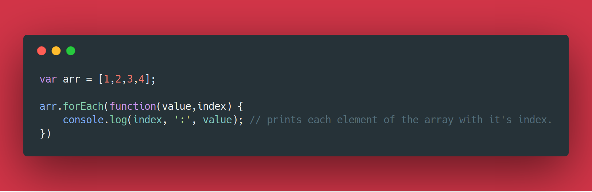

Functional programming is a hot topic amongst developers these days. Surprisingly it isn’t something new to the world. The first functional language Lisp came out in 1958. But it was not as popular as Imperative languages like C, Fortran etc. These languages overshadowed the functional ones. In 1972 the world was presented with Object-oriented programming(OOP), which was followed by the introduction of OOP languages like C++ (in 1980) and Java (in 1995). This was a big hit in the software industry, In fact, OOP took over the industry and dominates until today.

Though some would argue that very few of the top programming languages are purely functional, which is true. But many languages have adopted ideas from functional programming and have imbibed some really cool features. Some of the purely functional programming languages are Haskell, Elm, and Lisp. A lot of other multi-paradigm languages also support functional programming like Javascript, Python, Clojure, and Scala.

Functional programming gained limelight because of rise in popularity of javascript. JS was initially used only for client-side scripting, and later Node js was built which allowed them to write javascript on the server side too. This triggered the popularity of JS amongst web developers. Although Javascript is a multi-paradigm language, it embraces some important concepts of FP. Concepts like Higher order functions and closures are FP concepts.

## What is Functional Programming (FP)?

In Functional programming, we will be writing functions that take arguments, operate on them and produce results. Well, as you might guess this closely resembles the idea of functions in mathematics. In fact, the idea of FP is derived from mathematics itself. FP is declarative rather than Imperative, i.e. the developer can focus on *what to do* rather than *how it is to be done*. Take a look at the following example :

*Imperative approach.*

*Declarative approach.*

On running the code snippets both of them give the same output. But you can see the difference in the code representation. The first one (Imperative approach) loops through the array and prints the output. While the second one(Declarative approach) defines a function which tells what to do for each item present in the array.

Pure Functional Programming, in here all the functions defined only operate on the variables passed as arguments and are independent of variables defined in the global scope. Also, they don’t modify the variables in global scope, which is called *Immutablity*.

## Advantages

As these functions operate only on the arguments passed to them, they provide the same results regardless of when it has been called. This property is called Referential transparency. This is very advantageous, as it makes the code-base cacheable and testable; hence ensuring we write safe code. Also as these functionals operate independently, running them in multiple threads and not worry about thread synchronization; hence helping us write faster and parallel code. If you are familiar with UNIX and UNIX-like systems (Mac and Linux), you would know what are pipelines. Pipelines allow the output of one function to be passed to another function. Now similarly, as functions in FP take input and give output we can do something similar with them. This is called Composition. This allows us to model the whole software in small modules and compose them together to complete the software.

Well, I wouldn’t say functional programming is the silver bullet to software development and will overshadow OOP, That’s stupid. There are many disadvantages of writing functional code. Like, Having immutable state forces you to work with copies of variables, also having to use recursion a lot leads to loading the RAM and slowing down the application.

In conclusion, all I want to say is functional programming is cool and would be a great asset to know how to use it properly :D
