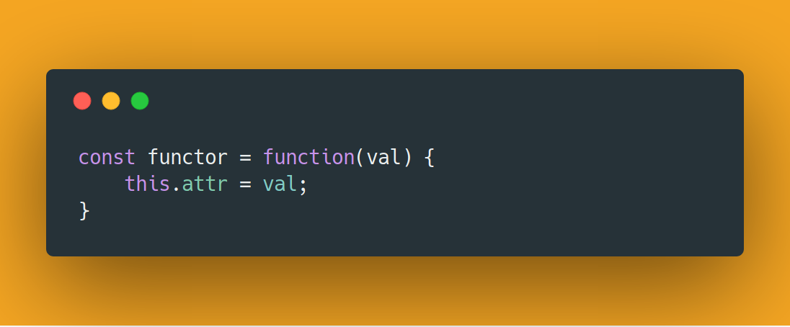
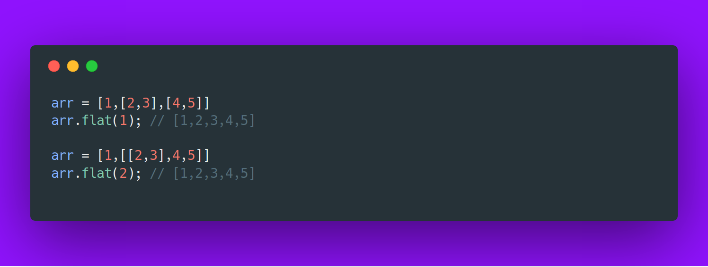

Functors and Monads are concepts of functional programming. They have heavy mathematical background which sometimes overwhelms developers. In here we’ll be ignoring the mathematics and try to understand what they are and why they are useful.

### Functor
> # It is an object in javascript that implements a map method, that after running over the values in the object return a new object.

Well, that does good for a definition, but what does it actually mean? Functors are basically containers. i.e. they just store values like any javascript object. Take a look at the code snippet below :

*A simple functor that just stores a value.*

Hold on, but according to the definition, functor must contain a function called ‘map’! So let’s define that too, But before that let’s define a method ‘of’ that returns a new Functor on being called with a value :

```javascript
const Functor = function (val) {
    this.attr = val;
}

Functor.of = function (val) {
    return new Functor(val);
}

Functor.prototype.map = function (fn) {
    return Functor.of(fn(this.attr));
}

let double = (x) => x + x;
console.log(Functor.of(3).map(double)) 

/*
Prints the following on the console: 
Functor { attr: 6 } 
*/
```

Now, take a look at the map function. It just calls the function ‘fn’ passed to it as a parameter and executes it with attribute ‘attr’ of the Functor as an argument. This newly created functor is returned. Line 13 defines a function that doubles the attribute passed to it. Line 14 logs the Functor returned after running map function with the double function.

You might be wondering what on earth does ‘map’ or mapping mean! Map is a function that takes a functor object, basically a value/set of values and processes them via a function that is given to it as a parameter. Then collects these processed values and puts them in a new functor object and returns it.

So basically functor is an object that has a method called ‘map’ defined in it, for example, Arrays. Pointed Functors are nothing but functors with an ‘of’ function defined in it that returns a new Functor, Just like the functor we defined above. The map function can also be chained :

```javascript

var res = Functor.of("Nobody")
    .map((val) => val.toUpperCase())
    .map((val) => "Hello " + val);

console.log(res); // Functor { attr: 'Hello NOBODY' }

```
You can see we just chained 2 maps one after the other. The first one returns a Functor with ‘attr’ as uppercase the ‘attr’ of the first functor. The second prepends “Hello” to it.

The map function basically allows functions to operate on any arbitrary data structure. Do you realize how powerful it is! So now you can define a function ‘capitalize’ that capitalizes string which was defined for a string and takes a string as a parameter. But this function can be run over all the elements in an array/tree or any data-structure for that matter of fact, without actually caring about the implementation. i.e we can focus more on what to do rather than how its to be done.

### Monads
> # It is a functor in javascript that implements a flatMap method.

What is a flatMap? it is a function that first maps each element using a mapping function and then flattens it by a depth of one. By flattening we mean we concatenate the sub-arrays to the original array. Look at the code snippet below.



As you can see a flat of depth 1 unwraps an array with 1 level of nesting, while a flat of depth 2 unwraps an array with 2 levels of nesting.
So now let’s look at the implementation of *flatMap* :

```javascript
arr = [1,2,3,4,5]

function map(arr,fn) {
    res = [];
    for(i in arr) {
        res.push(fn(arr[i]));
    }
    return res;
} 

// maps the function and the flattens it to a depth of one. 
function flatMap(arr,fn) {
    return Array.prototype.concat.apply([],map(arr,fn));
}

const mapperFn = (x) => {
    return [2*x];
}

console.log(map(arr,mapperFn)); // [ [ 2 ], [ 4 ], [ 6 ], [ 8 ], [ 10 ] ]
console.log(flatMap(arr,mapperFn)); // [ 2, 4, 6, 8, 10 ]
```
Let’s try to understand Line 13. So we are basically calling the *Array.prototype.concat* function with an *apply* method over it. The *concat* function takes appends the arguments to the array on which it was called on. The apply function reassigns the this variable to its first argument and the other arguments as params to the function it was called on. For example, in this case, the *concat* function will be called with the empty array “[]” as the array on which it will be operating, and the value returned from map(arr,fn) as the argument to the *concat* function. Basically, it translated to :

    [].concat(map(arr,fn));

The mapper function takes a variable and returns an array with the double of the variable as the only element in it. Now the difference of *map* and *flatMap* can be noticed here. Map returns an array with each element inside it within an array of its own, while *flatMap* flattens it and returns an array with individual elements.

You might be thinking where monads are used. Javascript promises are monads! they implement flatMap method using the *then* function. Think of it, Promises represent the promise object and does not represent the data that it holds. The then function takes a mapper function and maps the value in the promise and returns a flattened value rather than the promise.

That’s all for Functors and Monads. I will try to explain the apply() function more detailed in an upcoming post. Happy coding till then :) !
