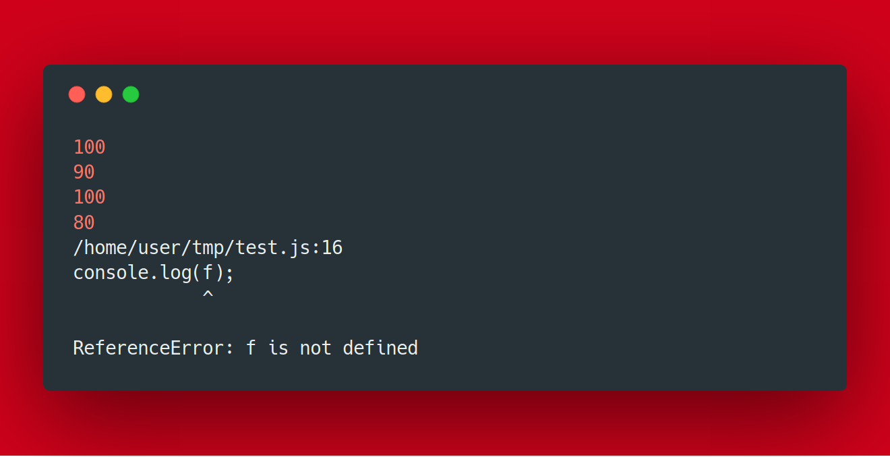
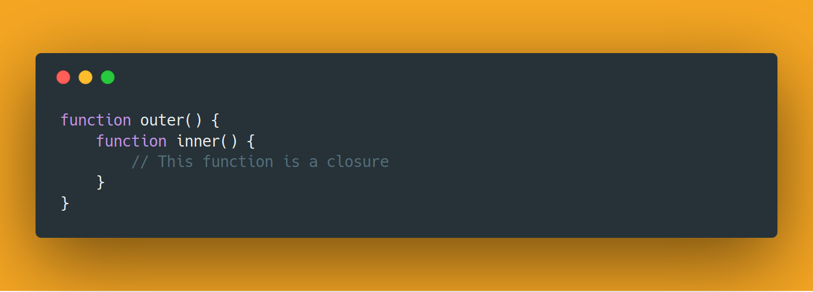
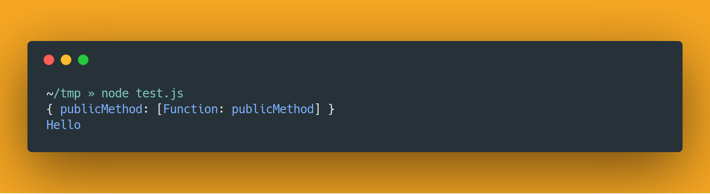

If you have been hanging out with javascript for long enough, you would have come across closures. And I wouldn’t be surprised if you are uncomfortable with them, even I was. It took a lot of reading to get a better understanding of what it is and how it works. In this post, we’ll explore higher order functions and closures in javascript. Note that they both are concepts derived from functional programming, and we’ll be using ES2015 javascript to explore them. Make sure that you are well acquainted with the arrow function syntax. Not many browsers support ES2015 so if you want to try out the code samples use [click here](https://babeljs.io/repl/).

### Higher-Order Functions

Something that is interesting to note is that in javascript, functions are first-class functions. i.e. function is also a data type, yes you heard me right! This might sound confusing and intimidating, but actually, that makes the language very powerful. It allows us to assign functions to variables and pass them as parameters to other functions and also return them as parameters.

Higher-Order functions are basically abstractions in programming. They help in abstracting the low-level operations hence making the code easier to understand. Let’s create our own for each function to get a better understanding :

```javascript
const arr = [1,2,3,4];

const forEach = (array,fn) => {
    for(element in array) {
        fn(element);
    }
}

forEach(arr, (val) => {
    console.log(val)
}) // prints the contents of the array on screen
```

Okay now let’s see what we did :

* Line no. 3 to 7 defines a function forEach which takes in an array and a function as arguments.

* Line no. 4–6 is a for loop that runs over each element in the array and executes the function over each element.

* Line no. 9–11 calls the forEach function with the array and a function definition as the arguments. The function defined here just prints out the value passed on to it.

Well, you can see we have abstracted away how the for loop is defined and executed and we have just defined what operation should be performed on each element. That makes the code more readable and easy to understand.

### Variable Scope

Now, what’s so special about a closure? For that, we should understand scopes in javascript. Scope can be defined as the accessibility of variables in code. There are two types of scopes :

**Global Scope:** Global is nothing but a window level scope, i.e. variable is can be accessed throughout the application.

**Local/Function Scope:** Local variables can be accessed only inside the functions that they are defined in.
> # NOTE: Unlike other languages, in JavaScript curly braces do not define new scopes. They fall into global scope.

Have a look at the example below to get a better understanding :

```javascript
var g = 100;

function fun () {
    var f=90;
    console.log(g);
    console.log(f);
}

{
    var b=80;
}

fun()
console.log(g);
console.log(b);
console.log(f);
```

Let’s understand what is happening in the code here :

* Line no. 3–7 defines a function fun, that defines variable ‘f’. And logs ‘f’ and ‘g’ to the console.

* Line no. 9–11: defines a block scope inside which we have defined the variable ‘b’.

* Line 13: executes the function fun.

* Line 14–16 : logs the variables ‘g’, ‘b’, ‘f’ onto the console.

The output for the code snippet is given below :

*The output for the code snippet.*

The first and second line is the output after executing the function ‘fun’. The next 2 lines the value of ‘g’ and ‘b’ in the global scope. While after that we see an error that ‘f’ is not defined, as it was defined inside the function so not accessible in the global scope.

### Closure

So now getting to closures, let’s see what are closures and why would you want to use them. When functions are defined inside functions, the inner function has access to the variables defined in the outer function; this property is called Closure. Look at the example below :

*The function named inner is a closure.*

The function named inner has access to the variables defined it the function outer, or the variables passed as arguments to outer. We saw the definition of scope above, that applies to the global function. But the scope of closure functions a bit more advanced. They have access to variables defines in its parent function too. That’s what makes closure function special. Let’s look at an example :

```javascript
function outer(arg) {
    return function inner() {
        arg++;
        console.log(arg);
    }
}

var fn = outer(5); // calls the function outer with 5 as the argument
console.log(fn); // output : [Function: inner]
fn(); // output : 6
fn(); // output : 7
```

Run the code snippet, and look at the output. Okay, what? Let’s see this line by line :

* Line no. 1–5 defines a function outer that takes ‘arg’ as a parameter.

* Line no. 2–4 defines a function, inner that increments arg and logs it to the console.

* Line 8 calls function ‘outer’ with 5 as an argument. That returns the ‘inner’ function. Now, an important thing to note is that the inner function has access to the variable ‘arg’, as ‘inner’ is a closure and by definition, it has access to the scope of its parent function (‘outer’ in this case).

* Line 9 logs the variable ‘fn’ to the console, and it shows it is of type function, with name inner.

* Line 10 executes the ‘inner’ function. Initially, the value of ‘args’ was 5, hence increments it to 6 and logs it to the console.

* Line 11 is interesting, it logs 7 to the console. What and how? So basically what is happening here is as ‘args’ is in its scope, it was updated to 6 on its previous change. Hence on calling it the second time, it increments it to 7.

Now that’s how closure work. Basically, it just adds the scope of its parent function too to its list of accessible variables. Let’s look at a more useful example :

```javascript
function obj(arg) {
    var privateMethod = function () {
        console.log(arg)
    }
    return {
        publicMethod : function () {
            privateMethod();
        }
    }
}

var obj1 = obj("Hello");
console.log(obj1);
obj1.publicMethod();
```

*The output for the code snippet.*

Okay, that must have been weird. Again, let’s go line by line :

* Line no. 1–10 defines a function ‘obj’ that takes an argument arg,

* Line no. 2–4 defines a function called ‘privateMethod’ which logs the ‘arg’ variable to the console.

* Line no. 5–8 returns an object that has a method defined called ‘publicMethod’. That executes the private method.

* Line 12 calls the function ‘obj’ with “Hello” passed on to it as an argument.

* Line 13 logs the ‘obj1’ on to the console. Notice one thing that it contains only the ‘publicMethod’ function. Hence abstracting away the rest of the attributes/methods defined in the ‘obj’ function.

* Line 14 calls ‘obj1.publicMethod’ which as expected prints “Hello” On the console.

Wasn’t that cool! we just implemented data abstraction in Javascript. This is one of the most powerful usages of closures in javascript.

Phew! This was a long one. Hopefully, you have a good idea of what closure is and where it is used. This is a very important topic that every javascript developer must have a good hold of.
