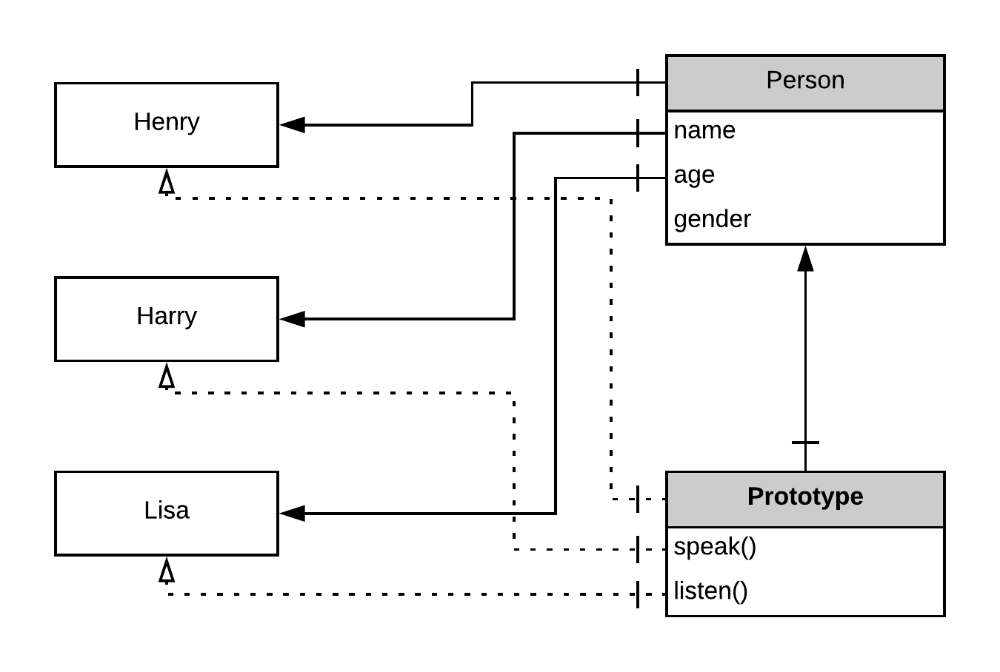

Inheritance enables objects to take properties from other objects. It is a concept of OOP, it helps developers write simpler and more understandable code. Unlike other languages, javascript takes a different approach to inheritance. It achieves inheritance via a property called object prototypes.

### The Prototype Object

Consider a case where you make multiple objects from a constructor, now each object will have its own copy of methods, hence loading the memory. This is where prototype comes into the picture. Every constructor function has a property called prototype. A Prototype is also a javascript object and every instance of the object created references the same prototype object. Every time a constructor is called with the new keyword, It creates a new instance of the object and has a secret link to the prototype defined for the object. This link allows access to the properties defined in the prototype object.



Now as we can see the object is linked to the prototype object, and now the prototype object could be linked to another prototype object hence leading to a prototype chain.

So when we call a method or a property from an object, the javascript engine first searches for it in the object definition. And if not available there, it searches for it in an object a step up in the chain and it continues to go up until it finds the property. At the end of every chain is the Object() object. So if the engine reaches there and still fails to find the property, then it returns undefined. Take a look at how prototypes are used in javascript :

```javascript
function person(name, age, gender) {
  this.name = name;
  this.age = age;
  this.gender = gender;
}

person.prototype.speak = function() {
  console.log(`Hi! I am ${this.name}.`);
}

person.prototype.listen = function(data) {
  console.log(`I heard that ${data}.`);
}

var p = new person("Henry",20,'M');

p.speak(); // prints "Hi! I am Henry." to the console.
p.listen("I'm Henry");// prints "I heard that I'm Henry." to the console.
```

### Prototypal inheritance

As I said earlier javascript implements inheritance via prototypes. So what we basically do is assign the prototype of the child object as the parent object. Take a look at the code snippet below :

```javascript
function Parent() {}

Parent.prototype.fn = function() {
  console.log("Hi! Im Parent");
}

function Child1(prop) {
  this.prop = prop;
}

function Child2(prop) {
  this.prop = prop;
}

Child1.prototype = new Parent();
Child2.prototype = new Parent();

var ch = new Child1(4);
ch.fn(); // Hi! Im Parent
```

Child1 and Child2 have their protoype object set to a Parent object. Hence every instance of Child1 or Child2 will be able to access properties from the Parent Object (line no. 19).

### Calling the constructor of the parent function

There are cases where we would want to instantiate the parent object via the constructor of the child object. This can be achieved by Parent.call(this, prop) , take a look at the following code snippet :

```javascript
function Parent(parentProp) {
  this.parentProp = parentProp;
  this.pEcho = function() {
    console.log(`Hi! I am ${this.parentProp}.`)
  } 
}

function Child(prop,parentProp) {
  // Inherits properties from the parent
  Parent.call(this,parentProp);
  
  this.prop = prop;
  this.cEcho = function() {
    console.log(`Hi! I am ${this.prop}.`)
  }
}

var ch = new Child("child","parent");
ch.pEcho(); // prints "Hi! I am parent." to the console
ch.cEcho(); // prints "Hi! I am child." to the console
```

the this in line no. 10 refers to the current object, the calling object. With the call method, you can write a method once and then inherit it in another object, without having to rewrite the method for the child object.

### Object.create()

What is wrong with assigning Child’s prototype as parent’s prototype, i.e. Child.prototype = Parent.prototype . The problem is that this gives direct access to the prototype of the parent object. Hence, parent’s prototype can be modified from the child. Wait, that doesn’t sound good does it? Luckily we have a solution to this, Object.create() .

The Object.create() method creates a new object, using an existing object to provide the newly created object’s prototype. Take a look at the example below :

```javascript
function Child(prop) {
  this.prop = prop;
}

var ch = Object.create(new Child("Hello!"));

console.log(ch.prop); // prints "Hello!" to the console. 
```

### hasOwnProperty() , getPrototypeOf(), And isPrototypeOf()

The hasOwnProperty() method returns a boolean indicating whether the object has the specified property as its own property (as opposed to inheriting it).

```javascript
function Parent() {
  this.parentProp = 10;
}

function Child(prop) {
  this.prop = prop;
}

Child.prototype = new Parent();

var ch = new Child();

console.log(ch.hasOwnProperty('prop')); // true
console.log(ch.hasOwnProperty('parentProp')); // false
```

parentProp is defined in the Parent object while prop is defined in the Child object. Hence when hasOwnProperty() is invoked on the Child object with prop as the parameter it returns true, but when invoked with parentProp as arguments it returns false.

The isPrototypeOf() method checks if an object exists in another object’s prototype chain. It is called from the parent object with the instance of the child object as its parameter.

The Object.getPrototypeOf() method returns the prototype of the specified object.

```javascript
function Parent() {}

const obj = Object.create(Parent);

console.log(Object.getPrototypeOf(obj) === Parent); // true
```

That should help one understand how inheritance is achieved in JavaScript. One may note that from ES6 onward, class as a keyword has been introduced into javascript. Which also supports inheritance out of the box, hence one won’t have to mess with the prototype object. But everything is based off the prototypal chain, and hence all of it is just a syntactical sugar over prototypes.
