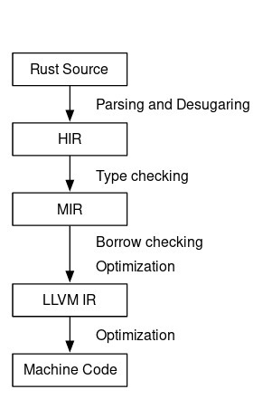
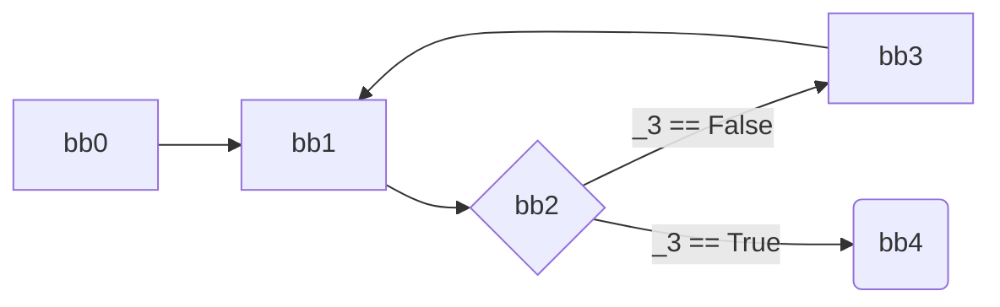

Rust is a system programming language developed by Mozilla. The language boasts the performance of C/C++ with the safety and ease of use of languages like Python. Rust achieves this by enforcing a strong type system and static analysis of the source code.

This article provides an overview of the compilation process and structure of Rust compiler. The main focus will be on the Mid-level Intermediate Representation (MIR) and understanding it.

## The Borrow checker

The core tool behind Rust which helps statically ensure that the code is memory and concurrency safe is its borrow checker. It ensures the following properties in the source code : 

* All variables are initialized before they are used.
* You can't move the same value twice.
* You can't move a value while it is borrowed.
* You can't access a place while it is mutably borrowed (except through the reference).
* You can't mutate a place while it is immutably borrowed.
* and more ...[Source](https://rust-lang.github.io/rustc-guide/borrow_check.html)

> Note: When we say move we are referring to the [move semantics](https://doc.Rust-lang.org/rust-by-example/scope/move.html). Only memory allocated on the heap is moved.

A simple example explaining move semantics:

```Rust
let mut x = vec![1,2,3] // initializes a vector. Vectors are allocated on heap.
let mut y = x; // x moved into y.
y.push(5); // works fine
x.push(5); // compiler throws an error saying "borrow of moved value: `x`"
```

As mentioned earlier; this article does not focus on how safety is guaranteed in Rust, rather on the mechanism which helps make the guarantees.  

More details about the borrow checker [here](https://rust-lang.github.io/rustc-guide/borrow_check.html).

## Unsafe Blocks

All programs that are compiled in Rust are safe, but that doesn't imply all safe programs are accepted by Rust. There are times when the programmer knows that the program is safe and won't lead to any undefined behaviors, but the Rust compiler may not be able to guarantee that. This is where [Unsafe blocks](https://doc.rust-lang.org/book/ch19-01-unsafe-rust.html) come into the picture.

Unsafe blocks gives programmers some extra functionalities, these code snippets have to be enclosed in unsafe blocks. Unsafe blocks allow developers to :

* Dereference a raw pointer
* Access or modify a mutable static variable

The Unsafe blocks do not bypass the borrow checker though. Bare metal programming (Embedded systems) generally use Unsafe blocks. The Standard library of Rust uses Unsafe blocks extensively. Though it might seem that the safety guarantees are compromised, It is not so. Unsafe does not imply Undefined behavior, it just means that in that section of code the responsibility of safety is on the developer and the compiler cannot make any strong guarantees.

## Background

The process of compilation can be understood in two phases:

* Parsing
* Machine code generation

Parsing phase is the phase where the source code is analyzed for errors and is converted to a simplified form so that it can be translated to machine code easily. All the safety checks are done in this phase.


<center>
    <a href="https://blog.Rust-lang.org/2016/04/19/MIR.html">Source</a>
</center>

* HIR : High-Level Intermediate Representation, It is a compiler-friendly representation of the abstract syntax tree (AST) that is generated after parsing, macro expansion, and name resolution
* MIR : Mid-Level Intermediate Representation, It is generated from HIR and borrow checking is done on this representation.

The Parsing phase consists of Rust Source, HIR and MIR.

## Introduction To MIR

MIR makes borrow checking easier, it helps have faster compile times and have better execution times. MIR enables more flexible borrowing rules than earlier which makes writing Rust code much easier.

MIR representation simplifies the code and makes it into a very primitive form to make the analysis easier. It is not recommended to use the MIR output of a code snippet to develop tools for analysis and profiling directly. MIR parsing can be done by accessing the Rust compiler internals in which the MIR is represented in data structures.  
 
## Viewing MIR

If you wish to view the MIR output locally on your system, run the following on the command-line : 

```bash
rustc main.rs --emit=mir # where main.rs is the code file
```

An easier way is to write code on [Rust Playground](https://doc.rust-lang.org/book/ch19-01-unsafe-rust.html) and check the MIR output right there (Option to view MIR output is available in the dropdown menu next to the *Run* button).

## Understanding MIR

The MIR output actually corresponds to a [control flow graph](https://en.wikipedia.org/wiki/Control-flow_graph). It is very similar to a flow chart. It helps understand program flow and 

Before looking into MIR, Let's look into some definitions which help understand it.

* statements: lines with one successor (sequentially). 
* terminators: actions with potentially multiple successors.
* Basic blocks: A basic unit of the control-flow graph made of a set of statements ending with a terminator (generally represented by *bbx*, x is any positive integer). This whole block executes sequentially and completely.
* Locals: Memory locations allocated on the stack (conceptually, at least), such as function arguments, local variables,and temporaries. These are identified by an index, written with a leading underscore, like *_1*. There is also a special"local" *_0*, which corresponds to the return value.
* Places: expressions that identify a location in memory, like *_1* or *_1.f* (For the fields of a value).
* Rvalues: expressions that produce a value. The "R" stands for the fact that these are the "right-hand side" of an assignment.

[Source](https://rust-lang.github.io/rustc-guide/mir/index.html)

Let's take a look at the MIR for a few code samples. Note that we won't be looking at the whole MIR translation but only the relevant parts. To view the MIR output, copy paste the code on Rust playground and view it.

The variables in the MIR representation do not have any names, as mentioned above they are represented as *_x* where x is any positive integer.

MIR output generally has comments which make it mostly self-explanatory, but we shall go through a few examples to get a basic understanding of MIR.

### Basic Code snippet

```Rust
fn main() {
    let mut x = 5;
    x = x + 10;
}
```

The MIR representation : 

```Rust
fn  main() -> () {
    let mut _0: ();                      // return place in scope 0 at main.rs:1:11: 1:11
    let mut _1: i32;                     // "x" in scope 0 at main.rs:2:9: 2:14
    let mut _2: i32;                     // in scope 0 at main.rs:3:9: 3:10
    let mut _3: (i32, bool);             // in scope 0 at main.rs:3:9: 3:15

    bb0: {
        StorageLive(_1);                 // bb0[0]: scope 0 at main.rs:2:9: 2:14
        _1 = const 5i32;                 // bb0[1]: scope 0 at main.rs:2:17: 2:18

        StorageLive(_2);                 // bb0[2]: scope 1 at main.rs:3:9: 3:10
        _2 = _1;                         // bb0[3]: scope 1 at main.rs:3:9: 3:10
        _3 = CheckedAdd(move _2, const 10i32); // bb0[4]: scope 1 at main.rs:3:9: 3:15

        assert(!move (_3.1: bool), "attempt to add with overflow") -> bb1; // bb0[5]: scope 1 at main.rs:3:9: 3:15
    }

    bb1: {
        _1 = move (_3.0: i32);           // bb1[0]: scope 1 at main.rs:3:5: 3:15
        StorageDead(_2);                 // bb1[1]: scope 1 at main.rs:3:14: 3:15
        StorageDead(_1);                 // bb1[2]: scope 0 at main.rs:4:1: 4:2
        return;                          // bb1[3]: scope 0 at main.rs:4:2: 4:2
    }
}
```

A few points to note and understand here : 

* *_0* the return value of the function.
* _*1* corresponds to the variable x in source code.
* *_2* and *_3* are temporary variables which are used to evaluate the addition in the source code (Line 3 in source code).
* StorageLive(*_1*) statement implies that storage has to be allocated for *_1* on the stack.
* `const 5i32` is an Rvalue, it is assigned to *_1* (Line 2 in source code).
* Line 12 in MIR representation moves *_1* into *_2* for performing the actual addition.
* Line 13 in MIR representation adds *_2* and `const 10i32` and stores the result in *_3*.
* Notice that *_3* is of type `tuple (i32, bool)`. This is to check integer overflow during addition. The CheckedAdd function stores the resultant value in *_3.0* (the first field in the tuple), and if integer overflow occurred in *_3.1*.
* The `assert(...)` checks if overflow occurred and prints "attempt to add with overflow" and exits, else jumps to the basic block *bb1*. Notice that this action is a terminator.
* The first statement in *bb1*, moves the result in *_3*.0 into *_1* (variable x).
* StorageDead(*_2*) deallocates the space on the stack for *_2*.

### Scopes

```Rust
fn main() {
    let mut y = 1;
    // scope 1
    {
        let z = 2;
    }
    y = 3;
}
```

The MIR representation :

```Rust
fn  main() -> () {
    let mut _0: ();                      // return place in scope 0 at main.rs:1:11: 1:11
    let mut _1: i32;                     // "y" in scope 0 at main.rs:2:9: 2:14
    scope 1 {
        let _2: i32;                     // "z" in scope 1 at main.rs:4:13: 4:14
        scope 2 {
        }
    }

    bb0: {
        StorageLive(_1);                 // bb0[0]: scope 0 at main.rs:2:9: 2:14
        _1 = const 1i32;                 // bb0[1]: scope 0 at main.rs:2:17: 2:18
        StorageLive(_2);                 // bb0[2]: scope 1 at main.rs:4:13: 4:14
        _2 = const 2i32;                 // bb0[3]: scope 1 at main.rs:4:17: 4:18
        StorageDead(_2);                 // bb0[4]: scope 1 at main.rs:5:5: 5:6
        _1 = const 3i32;                 // bb0[5]: scope 1 at main.rs:6:5: 6:10
        StorageDead(_1);                 // bb0[6]: scope 0 at main.rs:7:1: 7:2
        return;                          // bb0[7]: scope 0 at main.rs:7:2: 7:2
    }
}
```

Something important to note is how *_2 (z)* is killed (as its scope ends there) before the reassignment of *_1 (y)* to 3 (which is source code is out of *scope1*).

### If statements

A very important thing to not is that, as mentioned above statements in MIR are very primitive, thus keywords like if, for etc are not available. These statements are represented using the terminators mentioned above. The terminators depict a branching in the code flow.

```Rust
fn main() {
    let x = 5;
    let y;
    
    if x == 5 {
        y = 1;
    } else {
        y = 0;
    }
}
```

The Mir Representation :

```Rust
fn  main() -> () {
    let mut _0: ();                      // return place in scope 0 at main.rs:1:11: 1:11
    let mut _1: i32;                     // "x" in scope 0 at main.rs:2:9: 2:14
    let mut _3: bool;                    // in scope 0 at main.rs:5:8: 5:14
    let mut _4: i32;                     // in scope 0 at main.rs:5:8: 5:9

    scope 1 {
        let _2: i32;                     // "y" in scope 1 at main.rs:3:9: 3:10
        scope 2 {
        }
    }

    bb0: {
        StorageLive(_1);                 // bb0[0]: scope 0 at main.rs:2:9: 2:14
        _1 = const 1i32;                 // bb0[1]: scope 0 at main.rs:2:17: 2:18
        StorageLive(_2);                 // bb0[2]: scope 1 at main.rs:3:9: 3:10
        StorageLive(_3);                 // bb0[3]: scope 2 at main.rs:5:8: 5:14
        StorageLive(_4);                 // bb0[4]: scope 2 at main.rs:5:8: 5:9
        _4 = _1;                         // bb0[5]: scope 2 at main.rs:5:8: 5:9
        _3 = Eq(move _4, const 1i32);    // bb0[6]: scope 2 at main.rs:5:8: 5:14
        StorageDead(_4);                 // bb0[7]: scope 2 at main.rs:5:13: 5:14
        switchInt(_3) -> [false: bb1, otherwise: bb2]; // bb0[8]: scope 2 at main.rs:5:5: 9:6
    }

    bb1: {
        _2 = const 0i32;                 // bb1[0]: scope 2 at main.rs:8:9: 8:14
        goto -> bb3;                     // bb1[1]: scope 2 at main.rs:5:5: 9:6
    }

    bb2: {
        _2 = const 1i32;                 // bb2[0]: scope 2 at main.rs:6:9: 6:14
        goto -> bb3;                     // bb2[1]: scope 2 at main.rs:5:5: 9:6
    }

    bb3: {
        StorageDead(_3);                 // bb3[0]: scope 2 at main.rs:9:5: 9:6
        _1 = const 2i32;                 // bb3[1]: scope 2 at main.rs:11:5: 11:10
        StorageDead(_2);                 // bb3[2]: scope 1 at main.rs:12:1: 12:2
        StorageDead(_1);                 // bb3[3]: scope 0 at main.rs:12:1: 12:2
        return;                          // bb3[4]: scope 0 at main.rs:12:2: 12:2
    }
}
```

A few points to note and understand here : 

* *_3* is used for storing the results of the evaluation of the condition in the if statement.
* `_3 = Eq(move _4, const 1i32)` is where the condition is checked.
* Call to `switchInt` leads two 2 branches, if false goto *bb1*, else if true goto *bb2*.
* At the end of *bb1* and *bb2* there's a goto statement that jumps to *bb3*. 

### Loops

```Rust
fn main() {
    let mut x = 1;
    loop {
        x += 1;
        if x>5 {
            break;
        }
    }
    x = 10;
}
```

The Mir Representation :

```Rust
fn main() -> () {
    let mut _0: ();                      // return place in scope 0 at main.rs:1:11: 1:11
    let mut _1: i32;                     // "x" in scope 0 at main.rs:2:9: 2:14
    let mut _2: (i32, bool);             // in scope 0 at main.rs:5:9: 5:15
    let mut _3: bool;                    // in scope 0 at main.rs:7:12: 7:15
    let mut _4: i32;                     // in scope 0 at main.rs:7:12: 7:13
    scope 1 {
    }

    bb0: {
        StorageLive(_1);                 // bb0[0]: scope 0 at main.rs:2:9: 2:14
        _1 = const 1i32;                 // bb0[1]: scope 0 at main.rs:2:17: 2:18
        goto -> bb1;                     // bb0[2]: scope 1 at main.rs:4:5: 10:6
    }

    bb1: {
        _2 = CheckedAdd(_1, const 1i32); // bb1[0]: scope 1 at main.rs:5:9: 5:15
        assert(!move (_2.1: bool), "attempt to add with overflow") -> bb2; // bb1[1]: scope 1 at main.rs:5:9: 5:15
    }

    bb2: {
        _1 = move (_2.0: i32);           // bb2[0]: scope 1 at main.rs:5:9: 5:15
        StorageLive(_3);                 // bb2[1]: scope 1 at main.rs:7:12: 7:15
        StorageLive(_4);                 // bb2[2]: scope 1 at main.rs:7:12: 7:13
        _4 = _1;                         // bb2[3]: scope 1 at main.rs:7:12: 7:13
        _3 = Gt(move _4, const 5i32);    // bb2[4]: scope 1 at main.rs:7:12: 7:15
        StorageDead(_4);                 // bb2[5]: scope 1 at main.rs:7:14: 7:15
        switchInt(_3) -> [false: bb3, otherwise: bb4]; // bb2[6]: scope 1 at main.rs:7:9: 9:10
    }

    bb3: {
        StorageDead(_3);                 // bb3[0]: scope 1 at main.rs:10:5: 10:6
        goto -> bb1;                     // bb3[1]: scope 1 at main.rs:4:5: 10:6
    }

    bb4: {
        StorageDead(_3);                 // bb4[0]: scope 1 at main.rs:10:5: 10:6
        _1 = const 10i32;                // bb4[1]: scope 1 at main.rs:12:5: 12:11
        StorageDead(_1);                 // bb4[2]: scope 0 at main.rs:13:1: 13:2
        return;                          // bb4[3]: scope 0 at main.rs:13:2: 13:2
    }
}
```

Notice how the program flow for the loop looks like : 

* *bb0* : initializes _*1* (x).
* *bb1* : adds 1 to *_1* and stores it in *_2* (temporary variable).
* *bb2* : checks for the if condition and stores the result in *_3*.
* *bb4* : `x=10`



### Static variables

```Rust
static glob: u32 = 10;

fn main() {
    let x = glob + 5;
}
```

The Mir Representation :

```Rust
fn  main() -> () {
    let mut _0: ();                      // return place in scope 0 at main.rs:3:11: 3:11
    let _1: u32;                         // "x" in scope 0 at main.rs:4:9: 4:10
    let mut _2: u32;                     // in scope 0 at main.rs:4:13: 4:17
    let mut _3: (u32, bool);             // in scope 0 at main.rs:4:13: 4:21
    scope 1 {
    }

    bb0: {
        StorageLive(_1);                 // bb0[0]: scope 0 at main.rs:4:9: 4:10
        StorageLive(_2);                 // bb0[1]: scope 0 at main.rs:4:13: 4:17
        _2 = (glob: u32);                // bb0[2]: scope 0 at main.rs:4:13: 4:17
        _3 = CheckedAdd(move _2, const 5u32); // bb0[3]: scope 0 at main.rs:4:13: 4:21
        assert(!move (_3.1: bool), "attempt to add with overflow") -> bb1; // bb0[4]: scope 0 at main.rs:4:13: 4:21
    }

    bb1: {
        _1 = move (_3.0: u32);           // bb1[0]: scope 0 at main.rs:4:13: 4:21
        StorageDead(_2);                 // bb1[1]: scope 0 at main.rs:4:20: 4:21
        StorageDead(_1);                 // bb1[2]: scope 0 at main.rs:5:1: 5:2
        return;                          // bb1[3]: scope 0 at main.rs:5:2: 5:2
    }
}

static  glob: u32 = {
    let mut _0: u32;                     // return place in scope 0 at main.rs:1:14: 1:17
    bb0: {
        _0 = const 10u32;                // bb0[0]: scope 0 at main.rs:1:20: 1:22
        return;                          // bb0[1]: scope 0 at main.rs:1:1: 1:23
    }
}
```

## MIR of Heap allocated memory

The examples above only focus on stack allocations, let us take a look at heap allocated memory management.

### Basic example

```Rust
fn main() {
    let x = vec![1,2,3];
}
```

The Mir Representation (Only the code section of interest) :

```Rust
fn  main() -> () {
    let mut _0: ();                      // return place in scope 0 at main.rs:1:11: 1:11
    let _1: std::vec::Vec<i32>;          // "x" in scope 0 at main.rs:2:9: 2:10

    scope 1 {
    }

    bb0: {
        // ... Vector initialization
        goto bb1;
    }

    bb1: {
        drop(_1) -> bb2;                 // bb1[1]: scope 0 at main.rs:3:1: 3:2
    }

    bb2: {
        StorageDead(_1);                 // bb2[0]: scope 0 at main.rs:3:1: 3:2
        return;                          // bb2[1]: scope 0 at main.rs:3:2: 3:2
    }
}
```

Most of the code is boilerplate code for the vector initialization. Whats important to note is the function call `drop(_1)` where *_1* is the variable *x* (a Vector) in the source code. The drop function takes a value and calls the destructor of the object on it. 

### Moved values

```Rust
fn main() {
    let x = vec![1,2,3];
    move_function(x);
}

fn move_function(x: Vec<u32>){

}
```

The Mir Representation :

```Rust
fn  move_function(_1: std::vec::Vec<u32>) -> () {
    let mut _0: ();                      // return place in scope 0 at main.rs:6:30: 6:30

    bb0: {
        drop(_1) -> bb1;                 // bb0[0]: scope 0 at main.rs:8:1: 8:2
    }

    bb1: {
        return;                          // bb1[0]: scope 0 at main.rs:8:2: 8:2
    }
}

fn  main() -> () {
    let mut _0: ();                      // return place in scope 0 at main.rs:1:11: 1:11
    let _1: std::vec::Vec<u32>;          // "x" in scope 0 at main.rs:2:9: 2:10
    let _5: ();                          // in scope 0 at main.rs:3:5: 3:21
    let mut _6: std::vec::Vec<u32>;      // in scope 0 at main.rs:3:19: 3:20
    
    scope 1 {
    }

    bb0: {
        // ... Vector initialization
        goto bb1;
    }

    bb1: {
        StorageLive(_6);                 // bb1[2]: scope 1 at main.rs:3:19: 3:20
        _6 = move _1;                    // bb1[3]: scope 1 at main.rs:3:19: 3:20
        _5 = const move_function(move _6) -> bb2; // bb1[4]: scope 1 at main.rs:3:5: 3:21
    }

    bb2: {
        StorageDead(_6);                 // bb2[0]: scope 1 at main.rs:3:20: 3:21
        StorageDead(_1);                 // bb2[2]: scope 0 at main.rs:4:1: 4:2
        return;                          // bb2[3]: scope 0 at main.rs:4:2: 4:2
    }
}
```

Notice how *_1(x)* has been moved into 6 and passed as an argument to `move_function`, which implies *_1* is not valid in `main` from this point. Also, note how drop is not called on *_1* in `main`, but drop is called in `move_function`.

## Potential of MIR

Developers and Researchers are working on exploring the potential of MIR and other use-cases. [miri](https://github.com/rust-lang/miri), a interpreter for Rust's MIR is an outcome of as part of an undergraduate research course in 2015 at the University of Saskatchewan. *miri* can run binaries rust projects and detect certain classes of undefined behavior.

MIR representation opens doors for more static analysis over the source code. Due to it representing the source code in a control-flow graph, flow-sensitive analysis and profiling on the codebase will get much easier.
