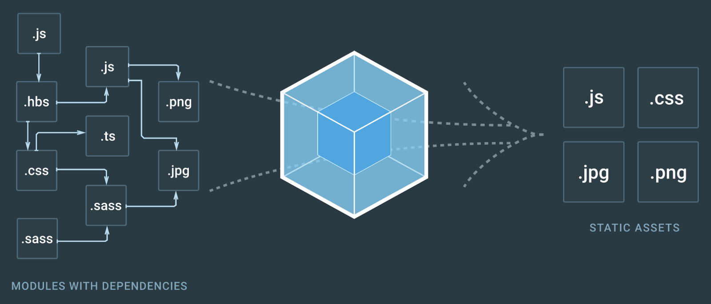

If you have worked with front end web frameworks/libraries like Vue, React or angular, you might have noticed most of the projects use a package called webpack. Webpack is a powerful tool used to configure these front end libraries to work with your project files and aid in building the application. In this series of posts we’ll see what is webpack and how to use it.

Webpack is a powerful module bundler that is used in frontend web development. By definition, a module bundler is a build tool that takes modules with dependencies and emits static assets representing those modules. When working on bigger projects, the codebase gets bigger and unmanageable over time. Hence to maintain the understandability and scalability of the code, we split the code into modules. In webpack even CSS/Sass files are treated as modules, these modules can be imported in JavaScript files using the **require()** statement. A module bundler basically takes in all your modules and stitches them together into a single file. You might not see it’s need while working on small projects, but as projects get bigger the dependency between modules gets complicated and tough to handle without a tool, this is where webpack comes to aid.

## Lets get started !

So before getting started with setting up Webpack, we need to understand the four Core Concepts of any Webpack configuration:

* Entry

* Output

* Loaders

* Plugins

Now, lets get to them one by one!

### Entry

The entry point indicates the Module that Webpack will use to begin building the internal dependency graph. after entering the entry module, it will figure out other modules and libraries that the entry module uses. now, this process happens recursively. i.e every time a module is imported it will check on the other modules that it depends on and import them. hence, building up something that looks like a graph (called the dependency graph).

### Output

The output point indicates the path to where the bundled code will be saved, and how it should be named.

### Loaders

Loaders enable Webpack to process more than just JavaScript files. hence, using loaders we can bundle other files such as CSS, images etc. essentially all the files are converted to modules that can be included in the dependency graph.

### Plugins

Plugins are kind of similar to modules, and it can be confusing sometimes to understand them. plugins basically can be used to perform a wider range of tasks. eg: file minification, bundle optimization. Loaders work at individual file level during or before the build. While Plugins are way more powerful than loaders. they can also modify how the bundles themselves are created. You will understand it when you start writing using them.

Well, now we saw the basic concepts of webpack. In the next post we’ll install webpack and get started work with it. [Click here](http://google) to continue.
