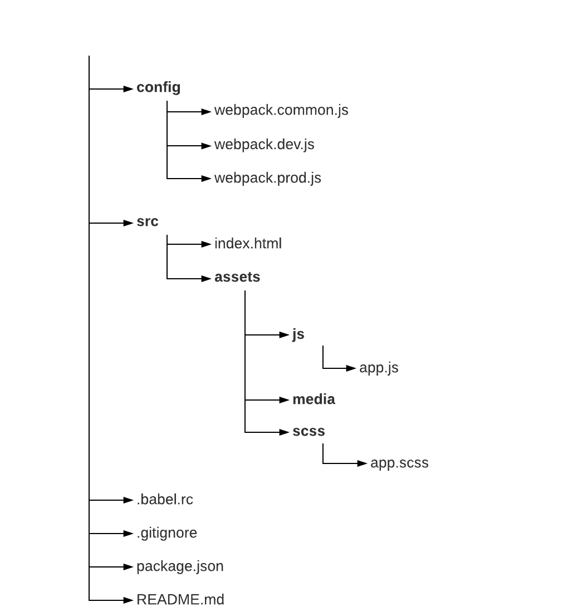

Hello everyone, let’s get started working with webpack. I would recommend that you read the previous post [Introduction to Webpack](https://medium.com/@kanishkarj/configuring-webpack-1-introduction-to-webpack-47076a2f969e) if you haven’t already. It is expected that you have Node js and npm installed, if you don’t please visit [Node.js](https://nodejs.org/en/). We’ll be using webpack 4, the latest version available while writing this post.

## Creating the required folders

First we’ll create the required folders to save our files. Open the terminal, and execute the following commands in it :

    mkdir [folder-name] && cd [folder-name]
    mkdir src src/assets src/assets/js src/assets/media src/assets/scss config

## Creating required files

Execute the following commands in the terminal to create required files :

    touch .babelrc .gitignore README.md config/webpack.common.js config/webpack.dev.js config/webpack.prod.js src/index.html src/assets/js/app.js src/assets/scss/app.scss



*Directory Structure*

## Initiating npm and git

Execute the following commands in the terminal :

    git init
    npm init

The second command initiates npm in the project. While doing so it asks few questions regarding the project, then it creates a package.json file in the repository. This file holds the details of the project and the packages required.

## Installing webpack and dependencies

Let’s now install webpack and other modules that we’ll need. Execute the following command in the terminal :

    npm install -D webpack-dev-server webpack webpack-merge webpack-cli

It’s obvious why we installed webpack. but why the other two? webpack basically bundles all the modules and emits them into a file. but during development, we cannot afford to repetitively bundle the modules after every small change, **webpack-dev-server** comes for rescue. This package sets up a development server with hot reloading and other cool features. Also if you noticed we have 3 webpack config files. *webpack.common.js* contains the configuration common to development and production. *webpack.dev.js* contains configurations specific to the development stage, and similarly *webpack.prod.js* for Production specific configurations. We use **webpack-merge **to merge *webpack.common.js *with the other two.

## Writing npm scripts

Add the following scripts to the scripts section in the package.json :

*package.json*
```javascript
    "scripts": {
      "start": "webpack-dev-server --inline --hot --open --config config/webpack.dev.js",
      "build": "webpack --config config/webpack.common.js",
      "build:prod": "webpack -p --config config/webpack.prod.js"
    },
```
*start* : starts the webpack dev server.

*build* : builds the project and outputs the files in developer mode.

*build:prod* : builds the project and outputs the files in production mode.

--config : it is used to specify the path to the configuration file.

## Webpack Configuration

Now let’s started off with writing the configuration files. First, we define a constant object inside the webpack.common.js and export it :

```javascript
  const config = {
    // Here goes the configuration
  };
  module.exports = config;
```
## Defining the context

Context refers to the base directory. It is an absolute path, it resolves entry points and loaders from the configuration. By default, the current directory is used, but it’s recommended to pass a value in your configuration. This makes your configuration independent from the current working directory.

```javascript
  const config = {
    context: path.resolve(__dirname, "../src"),
    // Rest of the configuration
  }
```

We are referencing it by ‘../src’ rather than ‘src/’ because the path is defined with respect to the current directory, which is *config*.

## Defining the entry point

Let’s define the entry point for the application :

```javascript
const config = {
  entry: './src/app.js',
}
```

Let us assume a case where we need to specify different entry points. In that case we define *entry* as an object, then specify the entry path with a name to it. For example, here below we are calling it ‘app’ :

```javascript
const config = {
  entry: {
    app: './assets/js/app.js'
  },
}
```

## Defining the output point

This is the path where the bundled files will be saved. we shall define the output point as an object with 2 attributes, path, and filename :

* path : Its the absolute path to the prefered output directory.

* filename : it determines the name of each output bundle.

Now, we cannot define path variable with a definite string. As the path would change if the repository is copied to another directory or to another computer. Hence we use Node js **Path** module which gives us the absolute path to the project root directory.

```javascript
const path = require('path');
const config = {
  entry: {
    app: './assets/js/app.js'
  },
  output: {
    path: path.resolve(__dirname, '../dist'),
    filename: 'assets/js/bundle.js'
  }
}
```

Note that when configuring multiple output paths, i.e when multiple output files are expected; you should use one of the following substitutions to give each bundle a unique name. For example:

    filename: "assets/js/[name].bundle.js"

for other naming options [click here](https://webpack.js.org/configuration/output/#output-filename).

## Configuring the development server

The dev server package sets up a local development server, hence you won’t be accessing the application using file path. i.e if you want to view your project on the browser you can access it via *http://localhost:portNumber/*. Also if you look at the npm *start* script : webpack-dev-server --inline --hot --open --config webpack.dev.js.

--hot :enables hot-reloading which means the code will be re-bundled as soon as webpack notices changes in the files.

--open :opens the application in the browser.

The development configurations will be written in the webpack.dev.js file. first, we import **webpack-merge** and **webpack.common.js**, and the Node js **path** package.

```javascript
const path = require('path');
const merge = require('webpack-merge');
const common = require('./webpack.common.js');
```
First let’s write the configuration, then we’ll try to understand what it means :

```javascript
module.exports = merge(common, {
  devtool: 'inline-source-map',
  devServer: {
    contentBase: path.resolve(__dirname, "./dist/assets/media"),
    compress: true,
    port: 8004,
    stats: 'errors-only',
    open: true
  }
});
```

* *devtool* : It refers to the style of source mapping, its value can affect the build and rebuild speed dramatically. [to learn more](https://webpack.js.org/configuration/devtool/)

* *devServer.contentBase* : It refers to the path from where all media/static files will be served. [to learn more](https://webpack.js.org/configuration/dev-server/#devserver-stats-)

* *devServer.compress* : Enables gzip compression for everything served. [to learn more](https://webpack.js.org/configuration/dev-server/#devserver-compress)

* *devServer.port* : The port no. you want your application to be deployed to. [to learn more](https://webpack.js.org/configuration/dev-server/#devserver-port)

* *devServer.stats* : It lets you precisely control what bundle information gets displayed. [to learn more](https://webpack.js.org/configuration/dev-server/#devserver-stats-)

* *devServer.open* : If set true, the sever opens the browser. [to learn more](https://webpack.js.org/configuration/dev-server/#devserver-open)

So this is what we have so far :

#### package.json
```javascript
{
  "name": "webpack-config",
  "version": "1.0.0",
  "description": "",
  "main": "webpack.common.js",
  "scripts": {
    "start": "webpack-dev-server --inline --hot --open --config config/webpack.dev.js",
    "build": "webpack --config config/webpack.common.js",
    "build:prod": "webpack --optimize-minimize --config config/webpack.prod.js"
  },
  "author": "",
  "license": "ISC",
  "devDependencies": {
    "webpack": "^4.4.1",
    "webpack-cli": "^2.0.13",
    "webpack-dev-server": "^3.1.1",
    "webpack-merge": "^4.1.2"
  }
}
```

#### webpack.common.js
```javascript
const path = require('path')

const config = {
  context: path.resolve(__dirname, "../src"),
  entry: {
    app: './assets/js/app.js'
  },
  output: {
    path: path.resolve(__dirname, '../dist'),
    filename: 'assets/js/[name].bundle.js'
  }
};

module.exports = config;
```

#### webpack.dev.js
```javascript
const path = require('path')
const merge = require('webpack-merge');
const common = require('./webpack.common.js');

module.exports = merge(common, {
  devtool: 'inline-source-map',
  devServer: {
    contentBase: path.resolve(__dirname, "./dist/assets/media"),
    compress: true,
    port: 8004,
    stats: 'errors-only',
    open: true
  }
});
```

The complete repository can be viewed [here](https://github.com/kanishkarj/webpack-html-boilerplate/tree/b3c3e093b605c084c5a63ea7f3caae0f85a7f27e).

Let’s test our Configuration. Open the terminal and navigate to the project directory and then execute npm run start. Everything should work fine. An instance of the browser will start saying “CANNOT GET /”, that is because we have not defined any HTML file.

Now let’s move on and enable webpack to load HTML, Sass files and ES6 Javascript.
